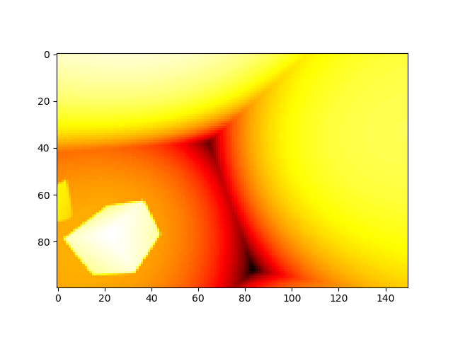
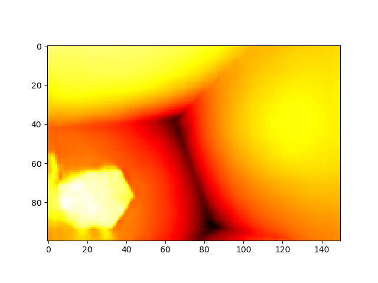

# DenseMapNet_Keras
Implementation of DenseMapNet in Keras

The method is suggested by Rowel Atienza. Here is DenseMapNet publication: <a href="https://arxiv.org/abs/1805.07499">https://arxiv.org/abs/1805.07499</a>

Download the dataset from the link below:

<a href="https://github.com/LouisFoucard/DepthMap_dataset">DepthMap_dataset</a>

Input stereo images:

Ground truth:

Here is the result after 800 epochs:

